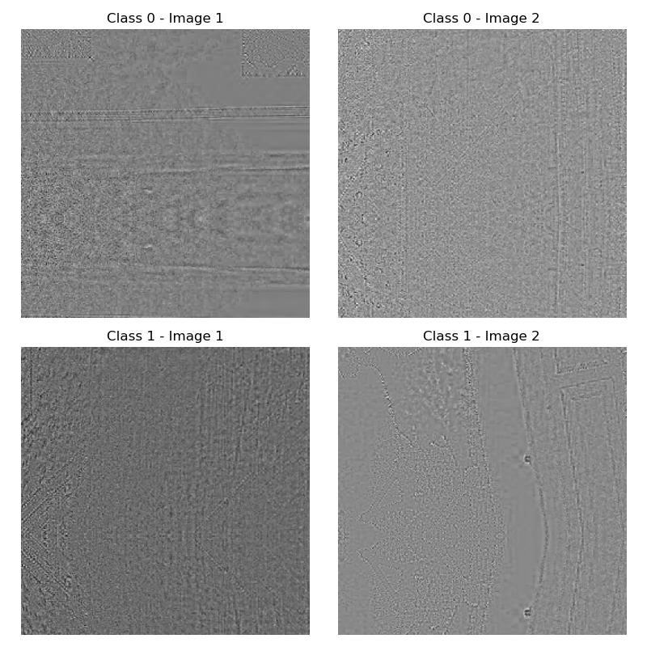
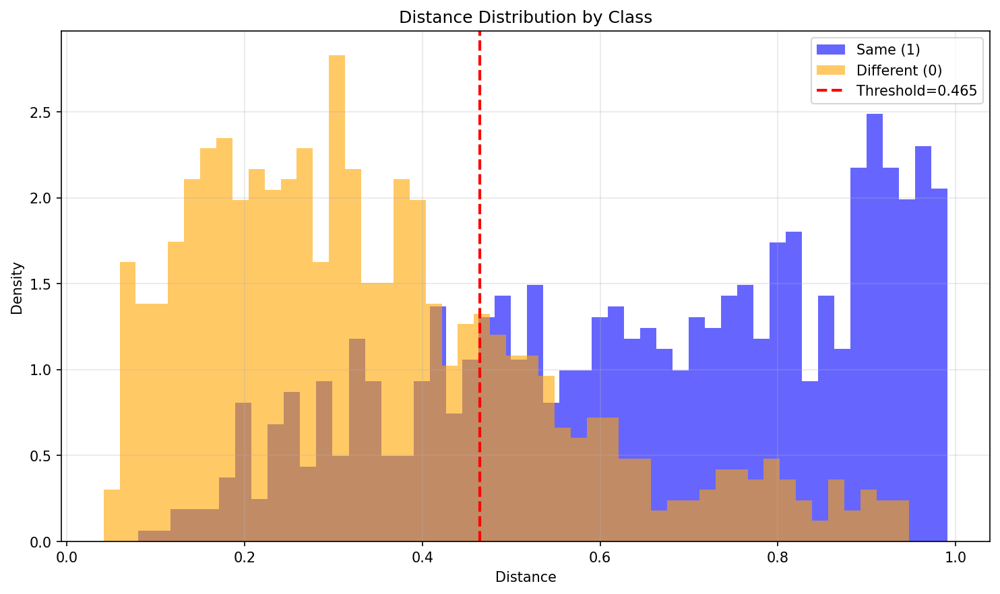
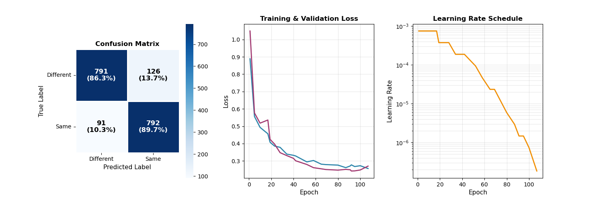
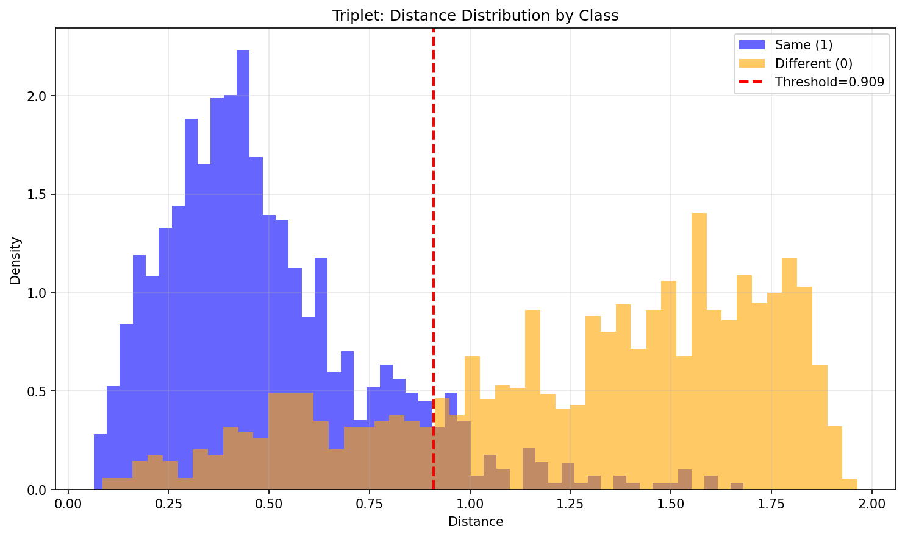

<h1>Image Noise Distribution Matching</h1>

<h2>A machine learning approach for determining distribution similarity in noise images</h2>



<br>
<hr>
<h2>About it</h2>

<p>The current application purpose is to determine if a pair of noise images belong to the same probability distribution or not.</p>

<p>The problem is structured around analyzing various noise distributions to deduce similarities between them. Unlike typical image classification tasks that rely on semantic content, this challenge requires analyzing subtle statistical patterns in pure noise images that are visually indistinguishable to humans.</p>

<p>The code purpose is to solve the following main tasks:</p>
<ol>
    <li>Extract meaningful features from noise images</li>
    <li>Train models to detect distributional similarities</li>
    <li>Classify image pairs as same or different distribution</li>
</ol>

<p>This project implements two main approaches:</p>
<ul>
    <li><strong>Baseline approach</strong>: Statistical feature engineering combined with traditional machine learning classifiers (Logistic Regression, Random Forest, Gradient Boosting)</li>
    <li><strong>Advanced approach</strong>: Deep metric learning using Triplet Loss Siamese Networks to learn an embedding space where distributional similarity can be measured</li>
</ul>

<p>The final model achieves <strong>90.5% accuracy</strong> on the test set, representing a significant improvement over the baseline statistical approach.</p>

<br>
<hr>
<h2>How to use it</h2>

> **NOTE**: For this you will need to have <code>conda</code> installed. If you do not have it, you can install it by following the instructions from the <a href="https://docs.conda.io/projects/conda/en/latest/user-guide/install/index.html">official documentation</a>.

<p>For using the provided application you will need to install the dependencies by running the following code:</p>

```bash
conda create -n noise_matching python=3.10
conda activate noise_matching
conda install numpy scipy scikit-learn matplotlib seaborn pandas pathlib xgboost lightgbm tqdm
pip install tensorflow keras
```

<p>For creating a Python virtual environment you can use the following <a href="https://www.freecodecamp.org/news/how-to-setup-virtual-environments-in-python/">guide</a>. Then install the dependencies using <code>pip</code>.</p>

<p>This will create a new environment called <code>noise_matching</code> and install the required packages, using the <code>Python3</code>.</p>

<p>After that we will want to install the <code>Tensorflow</code> package with the MPS capabilities for the <code>MacOS</code>. This will ensure a faster processing time. For this we will use the following code:</p>

```bash
conda install -c apple tensorflow-deps
pip install tensorflow-macos==2.15.0
pip install tensorflow-metal==1.1.0
```

For `Windows` you can use the following code:

```bash
pip install tensorflow
```

<p>For other platforms or distribution, please refer to <a href="https://www.tensorflow.org/install/pip">official documentation</a>.</p>

<p>After the installation is complete, you will need to organize your data in the following structure:</p>

```
project/
├── data/
│   ├── samples/
│   │   ├── image1_1.npy
│   │   ├── image1_2.npy
│   ├── train.csv
│   ├── validation.csv
│   ├── test.csv
└── src/
    └── models/
        └── triplet_base.keras
```

<p>The data csv files should contain the following columns:</p>
<ul>
    <li><code>id_noise_1</code>: first image filename</li>
    <li><code>id_noise_2</code>: second image filename</li>
    <li><code>label</code>: 0 for different distributions, 1 for same distribution</li>
</ul>

<p>To run the baseline approach:</p>

```bash
python statistical_classifier/statistical_main.py
```

<p>To train the triplet network:</p>

```bash
python triplet_model/triplet_main.py  
```

<p>To train the classifier and make predictions on test data:</p>

```bash
python ensemble/ensemble_main.py
```

<br>
<hr>
<h2>How it works</h2>

<p>The application works in two main phases: a baseline statistical approach and an advanced deep learning approach.</p>

<h3>1. Baseline Approach: Statistical Feature Engineering</h3>

<p>The baseline approach extracts 25 hand-crafted statistical features from each image pair:</p>

<h4>Feature Categories:</h4>
<ul>
    <li><strong>Correlation Features (8)</strong>: Pearson and Spearman correlations (global and quadrant-based), FFT magnitude correlation, gradient magnitude correlation</li>
    <li><strong>Distribution Metrics (6)</strong>: Kolmogorov-Smirnov test, Wasserstein distance, Chi-square distance, Histogram intersection, Bhattacharyya distance</li>
    <li><strong>Moment Features (5)</strong>: Differences in mean, standard deviation, variance, skewness, and kurtosis</li>
    <li><strong>Pixel-wise Metrics (4)</strong>: MAE, MSE, maximum pixel difference, median pixel difference</li>
    <li><strong>Frequency Domain (2)</strong>: FFT magnitude correlation and MAE</li>
</ul>

<p>These features are then fed into traditional machine learning classifiers:</p>
<ol>
    <li><strong>Logistic Regression</strong>: Linear baseline with L2 regularization (C=1.0)</li>
    <li><strong>Random Forest</strong>: 300 trees with max depth 15</li>
    <li><strong>Gradient Boosting</strong>: 300 estimators with learning rate 0.05 and max depth 5</li>
    <li><strong>Ensemble Voting</strong>: Soft voting combination of all three models</li>
</ol>

<p>The best baseline model (Gradient Boosting) achieves <strong>76.17% accuracy</strong> on the validation set.</p>



<h3>2. Advanced Approach: Triplet Loss Siamese Network</h3>

<p>The deep learning approach reformulates the problem from binary classification to metric learning. Instead of asking "are these the same or different?", it learns to answer "how dissimilar are these in a learned embedding space?"</p>

<h4>Architecture Design:</h4>

<p>The network transforms 256×256 grayscale images into 384-dimensional L2-normalized embeddings through a four-block convolutional architecture:</p>

<ul>
    <li><strong>Block 1</strong>: 96 filters, 3×3 conv, 2×2 pooling → 128×128×96</li>
    <li><strong>Block 2</strong>: 192 filters, 3×3 conv, 2×2 pooling, dropout 0.25 → 64×64×192</li>
    <li><strong>Block 3</strong>: 384 filters, 3×3 conv, 2×2 pooling, dropout 0.33 → 32×32×384</li>
    <li><strong>Block 4</strong>: 768 filters, 3×3 conv, global avg pooling → 768</li>
    <li><strong>Dense layers</strong>: 768 → 512 (dropout 0.33) → 384 → L2 normalize</li>
</ul>

<p>Each convolutional block includes batch normalization after convolution and ReLU activation.</p>

<h4>Triplet Loss Training:</h4>

<p>The network is trained using triplet loss with the following strategy:</p>
<ol>
    <li>Sample a same-distribution pair (anchor and positive)</li>
    <li>Randomly sample a different-distribution pair (negative)</li>
    <li>Feed all three through the network simultaneously</li>
    <li>Optimize so that anchor-positive distance < anchor-negative distance by margin</li>
</ol>

<p>The triplet margin of 0.75 balances separation and convergence. The model is trained with learning rate 0.00075, dropout rate 0.33, and L2 regularization 0.0001.</p>



<h4>Data Augmentation:</h4>

<p>To prevent overfitting while preserving distributional properties, only distribution-invariant augmentations are applied:</p>
<ul>
    <li><strong>Horizontal flips</strong> (50% probability): Noise distributions are spatially invariant</li>
    <li><strong>90° rotations</strong> (random k∈{0,1,2,3}): Preserves all distribution characteristics</li>
</ul>

<p>Critically avoided: intensity scaling, noise injection, spatial movements that would alter correlation and statistical properties.</p>

<h3>3. Combined Feature Representation</h3>

<p>The final classification combines both approaches:</p>
<ul>
    <li><strong>Statistical features</strong>: 14 selected features (Pearson, Spearman, MAE, MSE, KS test, moments, quadrant correlations, histogram metrics)</li>
    <li><strong>Embedding features</strong>: First 10 dimensions from the 384-d embedding space, plus embedding distance, cosine similarity, MAE, and max difference</li>
</ul>

<p>This hybrid approach captures both hand-crafted statistical insights and learned deep features, feeding into the same traditional classifiers (Logistic Regression, Random Forest, Gradient Boosting).</p>



<h3>4. Threshold Optimization</h3>

<p>Classification requires selecting a distance threshold τ. The optimal threshold τ = 0.909 provides:</p>
<ul>
    <li>Mean same-distribution distance: 0.4934 (σ = 0.2681)</li>
    <li>Mean different-distribution distance: 1.2744 (σ = 0.4524)</li>
    <li>Separation ratio: 2.58× (different/same)</li>
</ul>

<p>Pairs with distance < τ are predicted as same-distribution, otherwise different.</p>

<br>
<hr>
<h2>Tech specs</h2>

<h3>Dataset Statistics</h3>

<p>The dataset presents unique challenges:</p>
<ul>
    <li><strong>Image size</strong>: 256×256 grayscale</li>
    <li><strong>Class balance</strong>: 50/50 split between same and different distributions</li>
    <li><strong>Visual characteristics</strong>: Images are pure noise with no semantic content</li>
    <li><strong>Statistical overlap</strong>: Minimal separation in basic statistics (mean, std, kurtosis, skewness)</li>
</ul>


<h3>Baseline Model Results</h3>

<table>
<tr>
    <th>Model</th>
    <th>Accuracy</th>
    <th>Precision</th>
    <th>Recall</th>
    <th>F1-Score</th>
</tr>
<tr>
    <td>Logistic Regression</td>
    <td>73.50%</td>
    <td>73.83%</td>
    <td>71.23%</td>
    <td>72.51%</td>
</tr>
<tr>
    <td>Random Forest</td>
    <td>74.50%</td>
    <td>76.30%</td>
    <td>69.65%</td>
    <td>72.82%</td>
</tr>
<tr>
    <td>Gradient Boosting</td>
    <td><strong>76.17%</strong></td>
    <td>77.35%</td>
    <td>72.71%</td>
    <td>74.96%</td>
</tr>
<tr>
    <td>Ensemble</td>
    <td>75.72%</td>
    <td>77.20%</td>
    <td>71.69%</td>
    <td>74.34%</td>
</tr>
</table>

<h3>Feature Importance (Top 10)</h3>

<table>
<tr>
    <th>Rank</th>
    <th>Feature</th>
    <th>Category</th>
    <th>Importance</th>
</tr>
<tr>
    <td>1</td>
    <td>Spearman correlation</td>
    <td>Correlation</td>
    <td>0.18</td>
</tr>
<tr>
    <td>2</td>
    <td>Pearson correlation</td>
    <td>Correlation</td>
    <td>0.12</td>
</tr>
<tr>
    <td>3</td>
    <td>Top-left quadrant corr.</td>
    <td>Correlation</td>
    <td>0.11</td>
</tr>
<tr>
    <td>4</td>
    <td>Bottom-left quadrant corr.</td>
    <td>Correlation</td>
    <td>0.06</td>
</tr>
<tr>
    <td>5</td>
    <td>Bottom-right quadrant corr.</td>
    <td>Correlation</td>
    <td>0.05</td>
</tr>
<tr>
    <td>6</td>
    <td>Top-right quadrant corr.</td>
    <td>Correlation</td>
    <td>0.04</td>
</tr>
<tr>
    <td>7</td>
    <td>FFT correlation</td>
    <td>Correlation</td>
    <td>0.04</td>
</tr>
<tr>
    <td>8</td>
    <td>Mean difference</td>
    <td>Moment</td>
    <td>0.04</td>
</tr>
<tr>
    <td>9</td>
    <td>KS statistic</td>
    <td>Distribution</td>
    <td>0.03</td>
</tr>
<tr>
    <td>10</td>
    <td>Skewness difference</td>
    <td>Moment</td>
    <td>0.03</td>
</tr>
</table>

<p>Spearman and Pearson correlations dominate with 18% and 12% importance respectively. The quadrant-based correlations collectively contribute 26%, demonstrating that spatial locality matters significantly.</p>

<h3>Triplet Network Results</h3>

<table>
<tr>
    <th>Model</th>
    <th>Accuracy</th>
    <th>Precision</th>
    <th>Recall</th>
    <th>F1-Score</th>
</tr>
<tr>
    <td>Statistical Baseline</td>
    <td>76.17%</td>
    <td>77.35%</td>
    <td>72.71%</td>
    <td>74.96%</td>
</tr>
<tr>
    <td>Triplet Network</td>
    <td><strong>89.52%</strong></td>
    <td>88.43%</td>
    <td>88.67%</td>
    <td>88.55%</td>
</tr>
<tr>
    <td><strong>Improvement</strong></td>
    <td><strong>+13.35%</strong></td>
    <td>+11.08%</td>
    <td>+15.96%</td>
    <td>+13.59%</td>
</tr>
</table>

<h3>Error Analysis</h3>

<p>The triplet network dramatically reduces both error categories:</p>
<ul>
    <li><strong>False negatives</strong>: 95 (vs 246 in baseline) — 61% reduction</li>
    <li><strong>False positives</strong>: 119 (vs 183 in baseline) — 35% reduction</li>
    <li><strong>Error symmetry</strong>: FN/FP ratio of 0.80, indicating nearly balanced misclassification</li>
</ul>

<h3>Additional Metrics</h3>

<table>
<tr>
    <th>Model</th>
    <th>MAE</th>
    <th>MSE</th>
    <th>Spearman</th>
    <th>Kendall</th>
</tr>
<tr>
    <td>Statistical Baseline</td>
    <td>0.2339</td>
    <td>0.2339</td>
    <td>0.5321</td>
    <td>0.5321</td>
</tr>
<tr>
    <td>Triplet Network</td>
    <td><strong>0.2196</strong></td>
    <td><strong>0.1270</strong></td>
    <td><strong>0.7017</strong></td>
    <td><strong>0.5731</strong></td>
</tr>
</table>

<h3>Hyperparameter Exploration</h3>

<p>The final configuration was selected after systematic hyperparameter search:</p>

<table>
<tr>
    <th>Parameter</th>
    <th>Tested Values</th>
    <th>Selected</th>
    <th>Rationale</th>
</tr>
<tr>
    <td>Embedding dimension</td>
    <td>128, 192, 256, 384, 512</td>
    <td><strong>384</strong></td>
    <td>Performance plateaus; higher dims no improvement</td>
</tr>
<tr>
    <td>Base filters</td>
    <td>32, 64, 96, 128</td>
    <td><strong>96</strong></td>
    <td>Best accuracy with reasonable training time</td>
</tr>
<tr>
    <td>Learning rate</td>
    <td>0.0001, 0.0003, 0.00075, 0.001</td>
    <td><strong>0.00075</strong></td>
    <td>0.001 caused divergence; 0.0001 too slow</td>
</tr>
<tr>
    <td>Triplet margin</td>
    <td>0.5, 0.75, 0.85, 0.95</td>
    <td><strong>0.75</strong></td>
    <td>Balances separation and convergence</td>
</tr>
<tr>
    <td>Dropout rate</td>
    <td>0.0, 0.25, 0.33, 0.5</td>
    <td><strong>0.33</strong></td>
    <td>Aggressive but necessary; prevents 5-7% overfitting</td>
</tr>
<tr>
    <td>L2 regularization</td>
    <td>0.00005, 0.000075, 0.0001, 0.000125</td>
    <td><strong>0.0001</strong></td>
    <td>Optimal regularization strength</td>
</tr>
</table>

<h3>Training Configuration</h3>

<ul>
    <li><strong>Epochs</strong>: Up to 125 with early stopping (patience=15)</li>
    <li><strong>Batch size</strong>: 32 triplets</li>
    <li><strong>Optimizer</strong>: Adam with learning rate 0.00075</li>
    <li><strong>Loss function</strong>: Triplet loss with margin 0.75</li>
    <li><strong>Training time</strong>: ~2 hours on M2 PRO Mac with MPS acceleration</li>
</ul>

<h3>Key Insights</h3>

<ol>
    <li><strong>Metric learning superiority</strong>: Triplet loss reformulation immediately improved accuracy from 79-80% to 82%, then to 89.52% with optimization</li>
    <li><strong>Spatial locality matters</strong>: Quadrant-based correlations contribute 26% of feature importance</li>
    <li><strong>Balanced performance</strong>: Unlike baseline's conservative bias, triplet network achieves balanced precision-recall</li>
    <li><strong>Embedding quality</strong>: 96% mean prediction confidence with only 5.2% low-confidence samples</li>
    <li><strong>Distribution separation</strong>: Learned embeddings create more Gaussian distributions with less overlap than statistical features</li>
</ol>

<p>The significant reduction in false negatives demonstrates that the network successfully learned to recognize subtle same-distribution patterns that statistical correlations missed.</p>